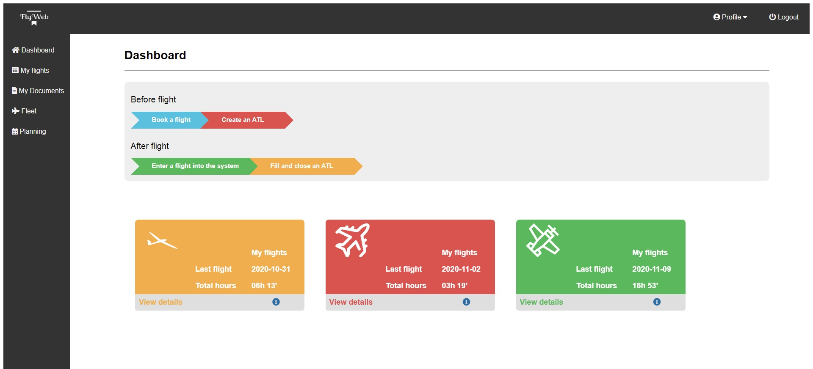

# FlyWeb
> This project offers a flight logging system for pilot schools who have various kind of licenses like ULM, Glider and PPL.

## Table of contents
* [General info](#general-info)
* [Screenshots](#screenshots)
* [Technologies](#technologies)
* [Features](#features)
* [Status](#status)
* [Inspiration](#inspiration)

## General info
The purpose of this project is to ease the work of the pilots, keeping track of the flights in a more organized and manageable manner. The users can add a flight with just a few clicks and types and after that they can view all informations about it sorted by the type of aircraft flown, date, departure and arrival place and many more.

## Screenshots



## Technologies
* HTML - version 5
* CSS
* PHP - version 7.4
* JavaScript - version 1.8.5
* MySQL
* AJAX

## Code Examples
```
<?php

if(isset($_GET['type'])) {
    $type = $_GET['type'];

    if( $type == 'all') {
        $sql= "SELECT * FROM fleet";
    } else {
        $sql= "SELECT * FROM fleet WHERE ( type = '".$type."')";  
    }     
}

if(isset($_GET['reg_number'])) {
    $reg_number = $_GET['reg_number'];

    $sql = "SELECT * FROM fleet WHERE aircraft_reg = '".$reg_number."' ";
}

$con = mysqli_connect('localhost','root','','flight_log');
if (!$con) {
  die('Could not connect: ' . mysqli_error($con));
}

mysqli_select_db($con,"flight_log");
$result = mysqli_query($con,$sql);

echo "<link rel='stylesheet' href='css/style_fleet.css'>";

echo "<table class='fly_table' style='margin-left: 15%;'>
<tr>
  <th>Registration number</th>
  <th>Manufacturer</th>
  <th>Model</th>
  <th>Short name</th>
  <th>Type of aircraft</th>
</tr>";

$counter = 0;
while($row = mysqli_fetch_array($result) ) {
  
  $remainder = $counter % 2;
  if($remainder == 0){
    //echo $number . ' is even!';
    echo "<tr class='tbody_row even'>"; 
} else {
  echo "<tr class='tbody_row' >"; 
}
     $counter++;

    echo "<td>" . $row['aircraft_reg'] . "</td>";
    echo "<td>" . $row['manufacturer'] . "</td>";
    echo "<td>" . $row['model'] . "</td>";
    echo "<td>" . $row['short_name'] . "</td>";
    echo "<td>" . $row['type'] . "</td>";
  echo "</tr>";
}
echo "</table>";
mysqli_close($con);
?>
```

## Features
* View flight experience categorized by type of aircraft flown
* View the available fleet owned by the organization
* Upload documents to get them verified
* Flight booking system
* Aircraft resource management

To-do list:
* Adding admin user privileges

## Status
Project is: _in progress_

## Inspiration
Project inspired by learning full stack web development.
